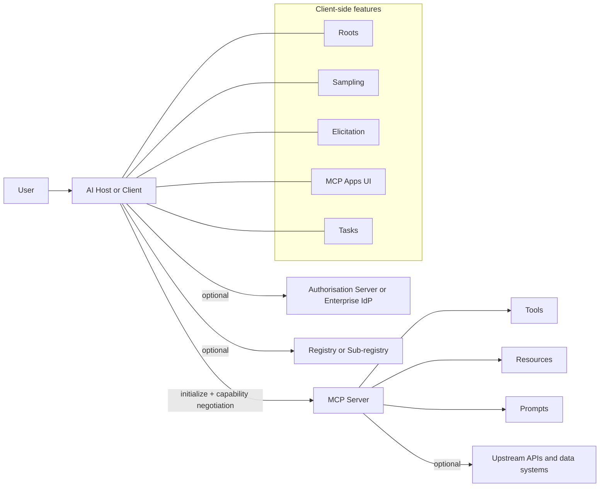
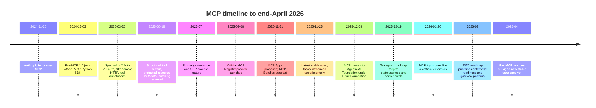

# Model Context Protocol as an integration backbone for enterprise and government AI

## Executive summary

**Bottom line.** **My analysis:** the Model Context Protocol should be treated as a **promising but not yet complete integration substrate** for AI-mediated access to many systems. By end-April 2026, it is no longer a niche Anthropic experiment: it has a formal specification lineage, official SDKs, a registry in preview, Linux Foundation stewardship through the entity["organization","Agentic AI Foundation","linux foundation fund"] under the entity["organization","Linux Foundation","open source foundation"], support in major clients, emerging enterprise auth extensions, and visible real-world deployments from vendors such as entity["company","OpenAI","ai company"], entity["company","Microsoft","technology company"], entity["company","GitHub","developer platform"], entity["company","Google Cloud","cloud computing platform"], and entity["company","Cloudflare","internet infrastructure company"]. But the strongest evidence also shows that discovery, registry governance, horizontal scalability, audit standardisation, and prompt-injection-safe composition remain active work rather than solved problems. citeturn19search4turn40search0turn14search1turn18view2turn18view3turn18view1turn10view0turn18view6

**Headline judgement.** **My analysis:** for a Government or Local Authority AI Hub, MCP is **robust enough to be used selectively and strategically**, but **not yet mature enough to be the only trust boundary or operational control plane**. The best fit is a **hybrid architecture**: MCP for interoperable connectors and cross-client portability, combined with enterprise IAM, a gateway/broker layer, private registries, explicit workflow/skills abstractions, and direct APIs for the most sensitive or latency-critical paths. citeturn34view0turn35view0turn38view0turn39view0turn14search1

The most decision-relevant insights are these:

- **Fact:** MCP’s core is now much stronger on authorisation than many early critiques imply. Since the March 2025 spec, MCP has had an OAuth 2.1-based HTTP authorisation model; by November 2025 it also had OIDC discovery support and clearer scope-challenge handling. By end-April 2026 it additionally had official extensions for client-credentials and enterprise-managed authorisation. citeturn7view2turn8search0turn7view0turn35view0turn34view0
- **Fact:** the most serious security problems are not hypothetical. Public advisories and research show prompt-injection-driven exfiltration, dangerous server composition patterns, and flaws in official or reference servers such as Git and Slack servers. Very recent April 2026 research also alleges a systemic stdio-command-injection class affecting many MCP-enabled products; that claim is important, but it had not yet been fully adjudicated by end-April 2026. citeturn25search3turn25search8turn25search11turn30search0turn30search6turn29search3turn29search7
- **Fact:** “MCP clogs the context window” is sometimes true, but primarily as an **implementation pattern**, not an unavoidable property of the protocol. Official client guidance now recommends progressive discovery, host-side caching, and programme-code-mediated tool calling; vendors are already shipping token-reduction changes. citeturn28view0turn28view2turn18view0turn18view6
- **Fact:** discovery is materially improved but still immature. The official registry is in preview, has no durability guarantees, is deliberately lightly moderated, and is not intended to be consumed directly by hosts. The roadmap explicitly pushes toward server cards, better discovery, and clearer gateway/proxy semantics because existing approaches are not yet sufficient. citeturn13search0turn38view0turn38view1turn38view2turn39view0turn14search1
- **My analysis:** MCP’s deepest value is not that it replaces APIs. It creates a **shared contract between AI clients and tool providers** so that organisations can avoid repeatedly rewrapping the same capabilities for each assistant, IDE, or agent framework. That “build once, expose everywhere” benefit is real, but it only materialises when an organisation has enough integration scale to justify standardisation overhead. citeturn18view4turn18view2turn18view3turn18view5turn45view3
- **My analysis:** agent frameworks and skills systems are not direct protocol substitutes. They usually operate at a different layer: orchestration, workflow semantics, reusable instructions, and UI. The evidence points towards **stacking** them above MCP rather than replacing MCP with them. citeturn45view4turn45view5turn45view6turn45view7turn20view1turn11search0turn14search1
- **My analysis:** in regulated settings, the critical decision is not “MCP or no MCP”, but **where to terminate trust**. If MCP terminates only at an enterprise broker that enforces identity, scope, audit, network policy, content controls, and approval policy, it becomes substantially more defensible. If end-user clients connect directly to arbitrary local or remote servers, it is much harder to justify in public-sector estates. citeturn31view1turn34view0turn35view0turn38view0turn39view0

**Recommendation.** **My analysis:** MCP is a good basis for a Government / Local Authority AI Hub **only if all of the following are true**: private or curated registry, mandatory gateway/broker, central IAM integration, default-deny networking, least-privilege per-tool scopes, formal onboarding/review of servers, durable audit logs, and explicit separation between low-risk read tools and high-risk write/destructive tools. Without those controls, a simpler API-gateway-plus-function-calling design is often safer and easier to govern. citeturn34view0turn35view0turn31view1turn38view1turn14search1

## Research setup and repository scaffold

### Method, evidence base, and plan updates

**Fact:** this report is based primarily on the MCP specification and official documentation, official vendor documentation and changelogs, MCP project blog posts, GitHub repositories and issues, GitHub advisories, and recent security papers and practitioner analyses, with a research cut-off of **27 April 2026** in Europe/London. Primary sources were prioritised; secondary sources were used mainly for capturing perception and controversy. citeturn7view3turn14search1turn38view0turn40search0turn44view2turn18view2turn18view3turn18view6turn29search0turn29search4

**Fact:** the plan changed in one important way during research. MCP is no longer just “tools, prompts and resources over JSON-RPC”. Between late 2025 and early 2026, three developments materially changed the assessment: formal governance under the Linux Foundation umbrella, official extensions such as MCP Apps and enterprise-managed authorisation, and an explicit roadmap focused on transport evolution, enterprise readiness, auditability, server cards, and skills-over-MCP. Those additions are central to sustainability and public-sector suitability, so they were brought into scope. citeturn40search0turn11search0turn34view0turn35view0turn14search1

**My analysis:** that plan update matters because many strong criticisms circulating in early and mid-2025 accurately described the protocol at that time, but no longer describe the end-April-2026 state. At the same time, the roadmap itself confirms that several enterprise concerns remain open rather than resolved. So the correct stance is neither “critics were wrong” nor “the protocol is finished”, but “the target moved, and some criticisms aged better than others”. citeturn24search1turn25search3turn39view0turn14search1

### Repository-ready Markdown and LaTeX structure

**My analysis:** the cleanest way to manage this report in GitHub is to keep source in Markdown, pre-render Mermaid diagrams, and compile via Pandoc + XeLaTeX. That keeps the workflow auditable, text-friendly, and easy to diff in pull requests.

```text
repo/
├─ README.md
├─ paper/
│  ├─ 00-preface.md
│  ├─ 01-executive-summary.md
│  ├─ 02-method-and-setup.md
│  ├─ 03-mcp-in-a-nutshell.md
│  ├─ 04-perceptions-critiques-mitigations.md
│  ├─ 05-alternatives-fastmcp-market.md
│  ├─ 06-government-ai-hub.md
│  ├─ 07-conclusion-glossary-sources.md
│  └─ bibliography.md
├─ diagrams/
│  ├─ architecture.mmd
│  ├─ timeline.mmd
│  └─ rendered/
├─ scripts/
│  ├─ render-mermaid.sh
│  ├─ build-pdf.sh
│  └─ build-docx.sh
├─ pandoc/
│  ├─ metadata.yaml
│  └─ eisvogel.tex
└─ Makefile
```

```bash
# Recommended environment
# - pandoc >= 3.1
# - TeX Live 2025/2026 with xelatex
# - mermaid-cli (mmdc)
# - make

# Render Mermaid
mmdc -i diagrams/architecture.mmd -o diagrams/rendered/architecture.svg
mmdc -i diagrams/timeline.mmd -o diagrams/rendered/timeline.svg

# Build PDF
pandoc \
  paper/00-preface.md \
  paper/01-executive-summary.md \
  paper/02-method-and-setup.md \
  paper/03-mcp-in-a-nutshell.md \
  paper/04-perceptions-critiques-mitigations.md \
  paper/05-alternatives-fastmcp-market.md \
  paper/06-government-ai-hub.md \
  paper/07-conclusion-glossary-sources.md \
  --from markdown+pipe_tables+table_captions \
  --pdf-engine=xelatex \
  --citeproc \
  --metadata-file pandoc/metadata.yaml \
  -o dist/mcp-government-report.pdf
```

**My analysis:** if the paper will be used for governance or procurement, keep diagrams as rendered SVG/PNG artefacts under version control, pin the Pandoc/TeX toolchain in CI, and separate “facts” from “analysis” in the source files exactly as in this report. That makes later refreshes easier when the next MCP spec release lands. citeturn14search1turn39view0

## MCP in a nutshell and how it evolved

### What MCP is and what sits inside it

**Fact:** MCP is an open protocol for connecting AI applications to external systems. In the official learning material, MCP servers expose capabilities to clients, most commonly **tools**, **resources**, and **prompts**. On the client side, the protocol also includes features such as **roots** for filesystem boundaries, **sampling** for server-initiated model calls, and **elicitation** for user-input requests. By November 2025 the spec also introduced **tasks** as an experimental primitive for long-running or deferred work. citeturn19search4turn19search12turn7view4turn7view5turn7view6turn7view7

**Fact:** MCP is transport-agnostic in principle, but as of end-April 2026 the project still treats **stdio** as the official local transport and **Streamable HTTP** as the official remote transport. Custom transports are permitted, but the official roadmap explicitly says no additional official transports are planned “this cycle”. That means **gRPC is not an official core transport yet**; instead, it is an active custom-transport track that entity["company","Google Cloud","cloud computing platform"] is trying to standardise with the community. citeturn9search4turn39view0turn10view0

**Fact:** for HTTP-based deployments, the authorisation model is now substantial. Protected servers must expose OAuth 2.0 Protected Resource Metadata, clients must discover authorisation servers from that metadata, clients must use resource indicators, PKCE is mandatory where applicable, and token passthrough is explicitly forbidden. There are also official extensions for machine-to-machine access and enterprise-managed access via an identity provider. citeturn8search0turn31view1turn35view0turn34view0

The high-level architecture looks like this. **Fact:** this diagram reflects the spec and official docs as of the November 2025 release plus the 2026 extension set. citeturn7view3turn8search0turn34view0turn35view0



**My analysis:** the cleanest mental model is that MCP is **not** a workflow engine, and **not** a policy engine, and **not** a catalogue with strong enterprise curation guarantees. It is a **capability exchange and invocation protocol**. That makes it powerful as plumbing, but it also explains why so many enterprise complaints trace back to layers above or around the protocol. citeturn19search18turn38view0turn39view0

### Major actors, offerings, and stated motivations

**Fact:** by end-April 2026, the MCP ecosystem had major backing well beyond Anthropic’s original launch. The official governance announcement says MCP moved into Linux-Foundation stewardship with support from Anthropic, Block, OpenAI, Google, Microsoft, AWS, Cloudflare, and Bloomberg through the Agentic AI Foundation. The official documentation and vendor docs show concrete implementations from several of those actors. citeturn40search0turn36view0

| Actor | MCP-related offering | Primary source | Stated motivation |
|---|---|---|---|
| entity["company","Anthropic","ai company"] | Original protocol launch, spec stewardship, Claude integrations, Agent Skills, MCP Apps collaboration | citeturn19search4turn20view1turn11search0turn40search0 | Open, community-driven standard; composable agent capabilities; cross-platform portability |
| entity["company","OpenAI","ai company"] | ChatGPT Apps SDK, MCP Apps support, remote MCP servers as a first-class tool type | citeturn45view1turn45view0turn45view3 | Extend ChatGPT and hosted agents with apps, tools, and external services |
| entity["company","Microsoft","technology company"] | Copilot Studio MCP integration, VS Code MCP support, Dynamics 365 ERP MCP server | citeturn18view2turn18view3turn18view4 | Reuse across agent platforms; consistent permissions and auditability; simplified development |
| entity["company","GitHub","developer platform"] | GitHub MCP Server, Copilot integration, registry support in clients | citeturn18view0turn18view1turn17search14 | Perform GitHub tasks directly from Copilot; reduce context cost; easier discovery |
| entity["company","Google Cloud","cloud computing platform"] | Gemini CLI MCP support, managed remote MCP servers, gRPC custom-transport work | citeturn18view5turn10view0 | Production MCP endpoints and better fit for enterprise gRPC estates |
| entity["company","Cloudflare","internet infrastructure company"] | Managed remote MCP servers and Cloudflare API MCP server | citeturn18view6 | Controlled account automation with OAuth and lower token overhead through codemode |
| entity["company","Block","fintech company"] | Goose client and MCP Apps support; AAIF co-founding | citeturn11search0turn40search0 | Reference implementation and user-centred agentic UX |

**My analysis:** this actor map matters because it shifts MCP from “one vendor’s connector scheme” toward “a shared interop layer with multi-vendor incentives”. That does not eliminate lock-in, but it does reduce the chance that the entire idea disappears if one vendor changes direction. The move into the Linux Foundation umbrella is strategically important for sustainability, even though the core maintainer set still remains central to technical direction. citeturn40search0turn42search5

### Timeline and the evolution that changed the picture

**Fact:** the protocol’s most important milestones are concentrated in eighteen months. The current stable spec at end-April 2026 is still the **2025-11-25** version; the draft changelog showed no new major changes yet, while the 2026 roadmap and transport blog pointed to a likely mid-2026 release focused on scalability, discovery, and enterprise readiness. citeturn7view0turn7view1turn7view2turn42search1turn14search1turn39view0



A few milestones are especially important.

- **Fact:** the March 2025 release is where “MCP has no security” stopped being an accurate shorthand for the HTTP side of the protocol. That release added a comprehensive OAuth 2.1 authorisation framework and replaced the earlier HTTP+SSE remote pattern with Streamable HTTP. citeturn7view2
- **Fact:** the June 2025 release tightened the protocol further: structured tool output arrived, OAuth resource-server metadata was aligned more closely with standards, and JSON-RPC batching was removed. citeturn7view1
- **Fact:** the September 2025 registry preview was the first official answer to discovery at ecosystem scale, but it launched explicitly as a preview with possible breaking changes and without durability guarantees. citeturn13search0turn38view0turn38view2
- **Fact:** the November 2025 release broadened MCP beyond basic tool calling via experimental tasks and auth/discovery improvements, while late 2025 and early 2026 introduced MCP Apps and auth extensions. citeturn7view0turn7view7turn11search0turn34view0turn35view0
- **Fact:** the December 2025 transport roadmap and the March 2026 roadmap are unusually candid in acknowledging unresolved scale and governance issues such as sticky sessions, server discovery, audit trails, and gateway semantics. citeturn39view0turn14search1

**My analysis:** the timeline shows a protocol maturing in the right direction, but still doing enterprise hardening **after** broad developer adoption started. That helps explain why the discourse is so polarised: advocates see real momentum and fixes; critics see early design trade-offs still being paid down in production. Both are substantially correct. citeturn24search1turn39view0turn14search1

## Perceptions, criticisms, and mitigations

### Perceptions map

**Reported opinions:** public discourse about MCP clusters into a few repeatable themes. The table below uses short, representative snippets rather than exhaustive sampling.

| Theme | Representative snippet | Who is speaking | Likely basis | Assessment |
|---|---|---|---|---|
| Universal connector | “USB-C port for AI applications.” citeturn19search4turn16search9 | Official docs and vendor explainers | Positioning and product framing | Broadly fair as a metaphor, but it hides governance/security work above the wire protocol |
| Sane separation of concerns | “access to tools ... from any compatible agent platform” citeturn18view4 | Microsoft product docs | Product design and enterprise reuse | Well supported; this is one of MCP’s strongest genuine advantages |
| Missing distributed-systems basics | “overlooks four decades of hard-won lessons” citeturn24search1 | entity["people","Julien Simon","tech commentator"] | Architectural critique | Partly vindicated by the transport roadmap’s own admissions |
| Security is fundamentally hard | “prompt injection security problems” citeturn25search3 | entity["people","Simon Willison","software developer"] | Security research and threat modelling | Strongly supported by later incidents and advisories |
| Tool/context bloat is real | “consumes about ~20% ... even when not in use” citeturn27view1 | Practitioner GitHub issue | Hands-on product usage | Real in some clients and servers, but implementation-specific rather than protocol-inevitable |

**My analysis:** the discourse is not random. Supporters tend to talk about **interoperability and developer experience**. Critics tend to talk about **distributed systems, security, and scale**. Those are not mutually exclusive. In fact, they describe the same protocol from different operational vantage points: local developer workflows versus regulated production estates. citeturn19search4turn24search1turn25search3turn39view0

### Misconceptions versus legitimate concerns

**Misconception:** “MCP has no security.”
**Fact:** for HTTP it now has an explicit authorisation scheme, discovery rules, protected-resource metadata, PKCE expectations, scope-challenge patterns, and official auth extensions. But stdio remains different: the draft spec says stdio implementations should not use the HTTP auth framework and will usually rely on environment-provided credentials or custom strategies. citeturn8search0turn35view0turn34view0turn42search3
**My analysis:** the correct statement is not “no security”, but “security is split across protocol, host, server, IdP, and composition policy — and the local-server path is inherently harder to govern”. citeturn32search0turn32search5turn31view1

**Misconception:** “MCP inherently floods context every turn.”
**Fact:** official best practices recommend progressive discovery, tool-definition caching, and code-mediated execution paths; the guide explicitly contrasts direct tool calling that can cost “~100K+ tokens” with a code-mediated path that can return only a short summary. citeturn28view0turn28view2
**My analysis:** naïve MCP usage can absolutely waste context; good MCP clients do not have to. This is a tooling maturity problem more than a protocol verdict. citeturn18view0turn18view6turn28view3

**Legitimate concern:** discovery and registry governance remain weak for enterprise use.
**Fact:** the official registry is in preview, lightly moderated, not durable, and intentionally pushes deeper curation to downstream aggregators or private registries. It does not support private servers and private package registries remain an open pain point for enterprise users. citeturn38view0turn38view1turn38view2turn27view2

**Legitimate concern:** current remote transport and sessions are awkward at scale.
**Fact:** the transport roadmap explicitly cites infrastructure complexity, sticky routing, stateful connections, ambiguous session scope, and the need for server cards and statelessness. citeturn39view0turn14search1

### Technical critique and mitigation matrix

**Fact and analysis:** the most important technical criticisms, the evidence for them, and the current state of mitigations can be summarised as follows.

| Area | Supporting evidence | Existing mitigation | Maturity | Residual risk |
|---|---|---|---|---|
| Discovery and registry | Official registry is preview-only, lightly moderated, not durable, and not for direct host consumption; enterprise issue on private registries closed as not planned. citeturn38view0turn38view1turn38view2turn27view2 | Downstream aggregators, private sub-registries, namespace verification, future server cards. citeturn13search0turn38view0turn39view0 | Early to medium | High for large enterprises unless they add their own registry layer |
| Context-window bloat and latency | GitHub cut about 23,000 tokens from a toolset; ZenMCP issue reported ~40,000 passive tokens; official best-practice diagram contrasts ~100K+ direct flow with code-mode summary return. citeturn18view0turn27view1turn28view2 | Progressive discovery, list caching, tool consolidation, codemode, brokered sandbox execution. citeturn28view0turn28view3turn18view6 | Medium | Medium, but drops sharply with disciplined client/server design |
| Security and identity | Prompt-injection warnings, lethal-trifecta examples, Git/Slack advisories, recent OX stdio research. citeturn25search3turn25search8turn25search11turn30search0turn30search6turn29search3 | OAuth 2.1 model, token-audience checks, no token passthrough, enterprise auth extension, client-credentials extension, local-install security requirements. citeturn8search0turn31view1turn34view0turn35view0turn32search0 | Medium for HTTP; low to medium for local/server composition | High where arbitrary local or third-party servers are allowed |
| Complexity and operations | Roadmap highlights gateway/proxy patterns, audit trails, config portability, session semantics as unresolved enterprise work. citeturn14search1turn39view0 | OTel trace-context conventions, tasks, SDK tiering, reference implementations, growing guidance. citeturn42search0turn7view7turn14search0turn14search1 | Medium | Medium to high for large estates |
| Positive technical benefits | Dynamics 365 cites reuse, auditability and no need for custom connectors or APIs; Copilot Studio and VS Code surface tools/resources/prompts/apps; OpenAI now treats remote MCP as a first-class tool type. citeturn18view4turn18view2turn18view3turn45view3 | N/A | Already real | Benefit is strongest when multiple clients must share one connector layer |

### Security and identity in more depth

**Facts.** The strongest official security principles in the spec are explicit user consent, data privacy, tool safety, and human review for sampling and elicitation. The security best-practices guide documents confused-deputy risks, token-passthrough risks, SSRF, and session hijacking, and the authorisation spec requires audience validation and forbids forwarding tokens through to upstream APIs. citeturn7view3turn7view5turn7view6turn31view0turn31view1turn8search0

**Reported opinions.** Independent critics have consistently argued that the MCP trust model interacts badly with prompt injection and composed-tool access. entity["people","Simon Willison","software developer"] has been especially influential here, warning in April 2025 that combining untrusted input with powerful tools creates confused-deputy conditions, and later documenting GitHub-, Supabase-, and Atlassian-related examples. Recent academic work reinforces that direction: one April 2026 paper argues that MCP inherits prompt-injection risk because tool descriptions and metadata are often treated as trusted instructions; a March 2026 paper argues for multi-layer defences spanning metadata analysis, model-decision tracking, anomaly detection, and user transparency. citeturn25search3turn25search8turn25search11turn29search0turn29search4

**My analysis.** The strongest security criticism is not that MCP uniquely invents prompt injection, but that it can **industrialise the blast radius** when many tools, identities, and systems are composed behind one conversational entry point. The protocol now has better identity plumbing than it did in early 2025, but identity alone does not solve indirect instruction attacks, dangerous tool combinations, or risky local-server installation flows. For government use, the security question is therefore primarily architectural: who approves servers, who owns the broker, where credentials live, and whether high-risk tool combinations are allowed at all. citeturn34view0turn35view0turn32search0turn31view1

### Context, performance, and cost in more depth

**Facts.** There is credible implementation-level evidence of token overhead. GitHub’s January 2026 changelog says consolidating one toolset reduced token usage by around **23,000 tokens**, or **50%**, for that area. A practitioner issue against ZenMCP reported roughly **40,000 tokens** of passive context use in Claude Code. Cloudflare’s API MCP documentation claims that exposing its full API natively as thousands of tools would cost roughly **1.17 million tokens**, while its codemode approach uses about **1,000 tokens**. The MCP client best-practices guide shows a comparison where direct chaining can push **~100K+ tokens** through the model, while a short script plus summary can keep the model-facing cost tiny. citeturn18view0turn27view1turn18view6turn28view2

**Reported opinions.** Performance scepticism is not just theoretical. Community complaints about verbose prompts, large tool lists, and wasted context appear in GitHub issues and practitioner commentary. Some of that chatter over-generalises from specific clients, but enough of it is grounded in real measurements that it should not be dismissed. citeturn27view0turn27view1turn25search12

**My analysis.** The right conclusion is two-part. First, MCP can be **too expensive** if implemented naïvely, especially when every capability is surfaced upfront as a giant JSON schema bundle. Second, MCP can also be **surprisingly efficient** when paired with progressive discovery, toolset consolidation, code-mode execution, or domain-specific aggregation patterns such as Cloudflare’s codemode. In other words, performance is a first-class architectural concern, but it is not a protocol death sentence. citeturn28view0turn28view3turn18view0turn18view6

## Alternatives, FastMCP, and the commercial landscape

### MCP versus direct APIs and function calling

**Facts.** OpenAI’s own function-calling guide describes a five-step loop: send tool definitions, receive a tool call, execute the code, send the result back, and then receive the model’s final answer. Semantic Kernel describes plugins similarly as grouped functions invoked behind model function-calling. LangChain describes tools as callable functions with structured inputs and outputs passed to a chat model. citeturn45view2turn45view7turn45view5

**My analysis.** Direct APIs plus function calling remain the best choice when all of the following apply: one or two AI clients only, strong existing API gateway/IAM controls, limited reuse needs, and low appetite for another protocol layer. In that setting, MCP adds packaging, discovery, and lifecycle complexity without enough offsetting benefit. But once many clients need the same tool layer, or external teams/providers need to publish capabilities once for broad AI consumption, direct wrappers start to fragment and MCP’s interop value rises quickly. citeturn45view2turn18view2turn18view3turn18view4

### MCP versus agent-framework-centric integrations

**Facts.** The official LangChain docs position LangChain as an open-source framework with a prebuilt agent architecture and integrations for any model or tool. Tools are framed as runtime-callable functions coupled to the model’s agent loop. Microsoft positions Semantic Kernel as a model-agnostic SDK for agents and multi-agent systems; its plugins encapsulate grouped functions that align with enterprise development practices and are invoked through function calling. citeturn45view4turn45view5turn43search14turn45view6turn45view7

**My analysis.** These frameworks are **not principally interop protocols**. They are orchestration environments. They are excellent when one development organisation owns the agent loop, the tools, the observability, and the deployment runtime. They are weaker as neutral publication layers across many clients and vendors. So “MCP versus LangChain/Semantic Kernel” is often a category error: the better comparison is **MCP underneath, framework above** versus **framework-only, no shared connector protocol**. The former usually wins once organisations want multi-client reuse or future portability. citeturn45view4turn45view5turn45view6turn45view7

### MCP versus skills and proprietary app ecosystems

**Facts.** Anthropic’s Agent Skills are directories of instructions, scripts, and resources loaded progressively; Anthropic explicitly says they can complement MCP servers. The MCP project itself now has “Build with Agent Skills” documentation and a Skills-over-MCP working-group charter listed in official project materials. The OpenAI tooling docs list **remote MCP servers** and **Skills** as different tool categories, while OpenAI’s Apps SDK and the MCP Apps extension show convergence around in-chat UI/app patterns rather than direct competition. citeturn20view1turn20view0turn14search1turn32search4turn45view3turn11search0

**My analysis.** Skills-like systems address a different problem from MCP. MCP says, roughly, **what external capabilities can be discovered and invoked**. Skills say **how an agent should behave, reason, and reuse domain knowledge or workflows**. In practice, skills can subsume some light connector use cases if the agent already has filesystem and shell access, but they do not replace the value of a shared transport and capability schema for remote or controlled enterprise systems. The likely steady state is layered: MCP for access, skills for behavioural guidance, and UI/app layers for human interaction. citeturn20view1turn11search0turn14search1

### FastMCP and what it really represents

**Facts.** FastMCP’s current active standalone project describes itself as a framework for building MCP servers, clients, and applications. Its release history says FastMCP 1.0 was incorporated into the official MCP Python SDK in 2024, after which the standalone project continued independently; its own docs warn that as the projects diverge, parity with the official API cannot be assumed. By end-April 2026 the latest GitHub release was **v3.2.4** on **14 April 2026**. Recent releases added a “Code Mode” capability in 3.1 and interactive application support via `FastMCPApp` in 3.2. citeturn22view0turn22view1turn23view0turn23view1turn21search10

**My analysis.** FastMCP is best understood not as a competing protocol, but as a **competing implementation philosophy**. It takes MCP and builds an opinionated developer platform above it: composition, proxying, UI, code mode, transforms, testing, auth conveniences, and application structure. That is valuable evidence about the future of the ecosystem. It suggests the market wants a relatively thin protocol core with much richer developer frameworks layered on top. For architects, that means adopting MCP does **not** answer the framework question; it merely standardises the connector seam. citeturn22view0turn22view1turn23view1

### Comparison matrix

**My analysis:** the table below is a judgement matrix rather than a transcription of any single source.

| Approach | Discovery | Security / IAM | Governance | Multi-client reuse | Maturity | Complexity | Lock-in |
|---|---|---|---|---|---|---|---|
| MCP core | Improving, but still immature without private registry/gateway | Stronger than early critics imply for HTTP; weaker for uncontrolled local use | Good if wrapped in enterprise controls; weak if used directly | Strong | Medium and rising | Medium | Medium |
| Direct APIs + function calling | No standard discovery | Usually strongest because it reuses existing API/IAM estates | Strong in mature API shops | Weak to medium | High | Low to medium | Medium to high per client |
| Agent frameworks without MCP | Internal to framework/runtime | Depends on framework and custom controls | Good inside one platform | Weak across many clients | High for orchestration | Medium to high | High |
| Skills-only / proprietary app ecosystems | Proprietary or host-specific | Varies by host | Often good inside vendor ecosystem | Weak outside that ecosystem | Medium | Medium | High |
| Hybrid: MCP + gateway + skills/framework | Best achievable balance | Strong if brokered through enterprise IAM and policy | Strongest | Strong | Medium | Highest initially, lowest long-run at scale | Medium |

### Hype versus substance

**Facts.** There is clear substance. Microsoft has MCP in Copilot Studio, VS Code, and Dynamics 365. GitHub has an official MCP server and Copilot integration. Google Cloud has managed remote MCP servers and is investing in gRPC transport support. Cloudflare offers managed OAuth-protected remote MCP servers and a token-efficient Cloudflare API server. OpenAI treats remote MCP as a first-class tool type and exposes MCP Apps concepts through the Apps SDK. citeturn18view2turn18view3turn18view4turn18view0turn18view1turn10view0turn18view6turn45view3turn45view0

**Facts.** At the same time, some of the infrastructure being marketed around MCP is still early. The official registry is preview-only, lightly moderated, and expects downstream markets and private registries to add curation and security scanning. The official roadmap still lists audit trails, enterprise auth, gateway/proxy patterns, and configuration portability as active “enterprise readiness” work. citeturn38view0turn38view1turn38view2turn14search1

**My analysis.** So the bandwagon critique is partly fair. MCP is now prominent enough that some offerings are clearly trying to position themselves as the “gateway”, “marketplace”, or “security layer” before standards have fully stabilised. But the existence of marketing does not mean the underlying protocol is hollow. The evidence supports a more precise view: **the connector substrate is real; the enterprise control-plane market around it is racing ahead of standardisation**. Procurement teams should reward concrete artefacts, not slogans: working products, clear auth/IAM stories, published threat models, versioning commitments, and evidence of real client support. citeturn38view0turn14search1turn40search0

## Implications for a Government and Local Authority AI Hub

### The decision problem

**Fact:** the official roadmap now explicitly calls out enterprise needs around audit trails, SSO-integrated enterprise-managed auth, gateway/proxy patterns, and configuration portability. Microsoft’s Dynamics 365 MCP documentation explicitly emphasises consistent data access, permissions, and auditability across agent integrations. These are exactly the concerns a Government / Local Authority AI Hub will face. citeturn14search1turn18view4

**My analysis:** the public-sector question is not whether conversational AI should talk to many systems. It already will. The question is **where to create the stable, governable integration seam**. MCP is a plausible answer only if it is bounded by public-sector controls, not if it is allowed to sprawl as a desktop-plugin free-for-all. citeturn32search0turn38view0turn14search1

### Three architecture options

#### MCP-centric hub

**Facts.** This model aligns with how vendors describe MCP: one client or hub can access many systems through MCP servers exposing tools, resources, and prompts; enterprise-managed auth can centralise access in the IdP; OpenAI, Microsoft, GitHub, Google Cloud and Cloudflare now all have products compatible with that basic shape. citeturn18view2turn18view3turn18view4turn45view3turn10view0turn18view6

**My analysis:** benefits are portability, connector reuse, and a clear ecosystem path. Risks are registry sprawl, composed privilege escalation, prompt-injection blast radius, and the present immaturity of standardised audit and gateway semantics. This option is attractive only for organisations willing to invest in a serious broker layer and private registry. Without that, it is too open-ended for sensitive public administration. citeturn31view1turn38view0turn39view0turn14search1

#### Agent-centric hub without MCP

**Facts.** Agent frameworks such as LangChain and Semantic Kernel already support tool/function abstractions and orchestration without MCP. Existing APIs and gateways can stay exactly where they are, with the agent layer wrapping them directly. citeturn45view4turn45view5turn45view6turn45view7

**My analysis:** benefits are strong control and lower protocol novelty. Risks are duplicated integration work, weaker portability across assistants and IDEs, and higher dependence on the chosen framework/vendor. This is often the right answer for a narrow estate or a high-security domain where only one AI runtime is allowed, but it scales poorly as the number of clients and systems grows. citeturn45view4turn45view7turn45view2

#### Hybrid hub

**Facts.** The MCP roadmap, Skills-over-MCP direction, and vendor convergence around Apps/UI all point toward layered designs rather than monocultures. Anthropic says Skills can complement MCP; OpenAI treats remote MCP, Skills, and apps as separate capabilities; MCP Apps itself emerged through collaboration with OpenAI Apps SDK work and MCP-UI patterns. citeturn20view1turn45view3turn11search0turn14search1

**My analysis:** this is the most credible public-sector pattern. Use MCP for **bounded connectors** to line-of-business systems and knowledge stores. Use workflow/skills/orchestration layers for business semantics, guardrails, and case handling. Use direct APIs where latency, assurance, or legal constraints are too strict for a generic conversational connector. This maximises reuse while keeping the most sensitive control points explicit. citeturn18view4turn34view0turn35view0turn14search1

### Recommended architecture stance

**My analysis:** for a Government / Local Authority AI Hub, the **hybrid option** is the best default.

Use **MCP aggressively** for:
- low-to-medium risk read access to documents, knowledge bases, workflow state, and structured case metadata;
- shared tooling that many clients will need;
- cross-client portability where multiple assistants or IDEs are in scope;
- domains where the same connector should work from a central hub, developer tooling, and future agent platforms.

Use **MCP selectively** for:
- write actions that are business-important but reversible and well-scoped;
- long-running tasks where task lifecycle and audit can be wrapped by a broker;
- remote systems where enterprise IdP and client-credentials extensions can be enforced. citeturn35view0turn34view0turn7view7

Prefer **direct APIs / non-MCP pathways** for:
- high-risk destructive operations;
- systems that already sit behind mature, policy-rich API gateways;
- workloads needing strict latency SLOs or binary/high-throughput RPC patterns, where direct gRPC or existing service meshes are already well optimised;
- environments whose organisational maturity is not sufficient to run private registries, brokers, and approval workflows. citeturn10view0turn39view0turn45view2

### Non-negotiable controls if MCP is used

**My analysis:** these controls are the minimum defensible baseline.

1. **A private or curated sub-registry only.** Do not let production clients install from the open public registry directly. The project itself says private servers belong in private registries and that the public registry is lightly moderated. citeturn38view0turn38view1

2. **A mandatory broker or gateway.** All remote MCP traffic should terminate at an enterprise-controlled service that handles token acquisition, audience checks, rate limiting, allow-lists, request/response logging, content controls, and approval policy. The roadmap itself identifies gateway/proxy patterns as an open enterprise requirement. citeturn31view1turn14search1turn39view0

3. **No unmanaged local server installation.** One-click local installs are too risky for enterprise fleets unless they are packaged, signed, reviewed and policy-controlled. SEP-1024 exists precisely because that path enables arbitrary command execution through malicious configuration. citeturn32search0turn32search5

4. **Least privilege at the tool level.** Separate read-only, write, destructive, and exfiltration-capable tools; use narrow scopes; do not allow token passthrough; prefer enterprise-managed auth and client credentials where appropriate. citeturn8search0turn31view1turn34view0turn35view0

5. **Human approval on sensitive transitions.** The host should require approval for destructive actions and for cross-server data movements where one tool’s output becomes another tool’s input. The official client best-practices guidance says the broker must still evaluate each sandbox-originated call against grants and warns that cross-server data flow remains untrusted. citeturn28view3

6. **Durable audit and tracing.** Persist prompt/tool invocation lineage, approvals, identities, scopes, and outputs in enterprise log pipelines. MCP has logging, tasks, and OTel trace-context conventions, but the roadmap correctly admits that enterprise-grade audit trails are still a work area. citeturn42search0turn7view7turn14search1

7. **Performance budgets and schema discipline.** Toolsets must be consolidated, descriptions pruned, discovery progressive, and code-mode/brokered execution used where appropriate. Treat tokens and latency as budgeted architectural resources, not incidental runtime details. citeturn18view0turn18view6turn28view0turn28view2

## Overall judgement, likely future, glossary, and source spine

### Final answer to the core question

**My analysis:** MCP is **not yet a sufficient basis by itself** for AI-mediated integration in government. It **is** a credible basis for the **connector layer** of such a system, provided that identity, policy, discovery, and audit are supplied by enterprise architecture around it. That puts MCP in the same category as many valuable open standards: strategically useful, operationally incomplete, and heavily dependent on the quality of surrounding controls.

Put differently:

- If the goal is a **single, governable conversational hub** with many reusable integrations across different AI clients, MCP is presently the best open interop candidate I found. citeturn18view2turn18view3turn18view4turn45view3turn40search0
- If the goal is a **small number of tightly controlled automations** in a mature API estate, direct APIs and framework-native tool calling are often simpler and safer. citeturn45view2turn45view7
- If the goal is a **future-proof public-sector platform**, the recommended answer is hybrid: MCP underneath, orchestrators/skills/workflows above, enterprise IAM and gateways around, and direct APIs retained for the most sensitive paths. citeturn20view1turn14search1turn34view0turn35view0

### Likely direction over the next year or two

**Facts.** As of end-April 2026, the documented priorities for the next protocol cycle are transport evolution toward statelessness, clearer session handling, server cards for discovery, agent-communication refinements for tasks, governance maturation, enterprise-ready audit and auth patterns, and better gateway/proxy semantics. The transport working group explicitly says no new official transports are planned in the current cycle, but the community should experiment through custom transports. citeturn14search1turn39view0

**My analysis:** the most likely near-future outcome is not that MCP disappears, but that it becomes **thinner at the core and thicker at the edges**:
- a thinner core protocol, especially for transport/session semantics;
- richer extension layers for UI, enterprise auth, events, and perhaps skills;
- stronger broker/gateway products in enterprise deployments;
- more “code mode” or deferred-discovery patterns to keep tokens down;
- continued coexistence with framework-native orchestration rather than replacement of it. citeturn11search0turn14search1turn39view0turn23view1

**My analysis:** the key variable to watch is whether the project can turn today’s roadmap into stable, boring, operationally predictable standards: server cards, stateless scale-out, clear gateway semantics, and audit-grade observability. If it can, MCP’s case in government strengthens substantially. If it cannot, MCP may remain strong in developer tooling and weaker in regulated back-office integration. citeturn14search1turn39view0

### Open questions and limitations

**Fact:** a few areas remain materially uncertain at the April 2026 cut-off. There was no new stable core spec release after 25 November 2025; some important late-April 2026 security claims, especially the OX Security stdio-command-injection framing, had visible disclosures but not yet a settled ecosystem-wide postmortem; and several adoption numbers are self-reported by project maintainers or vendors rather than independently audited. citeturn42search1turn29search3turn29search7turn40search0

**My analysis:** those limitations do not block a decision, but they do imply that any public-sector adoption should be paired with a formal refresh once the next core spec release lands and once the spring 2026 security disputes have stabilised. citeturn14search1turn39view0

### Glossary

**Fact:** these concise definitions are derived from the official documentation and specification.

- **MCP server**: a program exposing capabilities to an AI application, typically tools, resources, and prompts. citeturn19search6turn19search12
- **MCP client / host**: the AI application that connects to servers, negotiates capabilities, invokes tools, and mediates approvals. citeturn37view0turn18view3
- **Tool**: an executable function the model can call. citeturn19search12turn6search13
- **Resource**: file-like or retrievable context made available by a server. citeturn19search12turn18view2
- **Prompt**: a prewritten prompt template exposed by a server. citeturn19search12turn18view2
- **Roots**: filesystem or workspace boundaries exposed by the client to the server. citeturn7view4
- **Sampling**: a server asking the client to make model calls, ideally with a human in the loop. citeturn7view5
- **Elicitation**: a server asking the client to request information from the user. citeturn7view6
- **Tasks**: experimental durable state machines for deferred and long-running operations. citeturn7view7
- **Streamable HTTP**: the official remote transport introduced to replace the earlier HTTP+SSE approach. citeturn7view2turn39view0
- **Registry**: the official metadata catalogue for publicly accessible MCP servers, intended mainly for downstream aggregators and private sub-registries. citeturn38view0turn38view2
- **Server Card**: a proposed `.well-known` metadata document for pre-connection discovery. citeturn39view0turn14search1
- **MCP Apps**: the official UI extension allowing tools to render interactive interfaces inline in the client. citeturn11search0turn19search10
- **Agent Skills**: portable instruction/script bundles that help agents load procedural knowledge progressively; they complement rather than replace MCP. citeturn20view1turn20view0

### Source spine

**Primary sources used most heavily:** MCP specification and changelogs; MCP official docs on architecture, security, clients, registry, extensions, and roadmap; official vendor docs from OpenAI, Microsoft, GitHub, Google Cloud, and Cloudflare; FastMCP docs and releases; GitHub advisories. citeturn7view0turn7view1turn7view2turn8search0turn14search1turn38view0turn44view2turn18view2turn18view3turn18view4turn18view1turn10view0turn18view6turn23view0turn30search0turn30search6

**Secondary and independent sources used for critique and balance:** posts by entity["people","Simon Willison","software developer"] and entity["people","Julien Simon","tech commentator"], GitHub issues from practitioners, and recent arXiv security work. citeturn25search3turn25search8turn25search11turn24search1turn27view0turn27view1turn29search0turn29search4