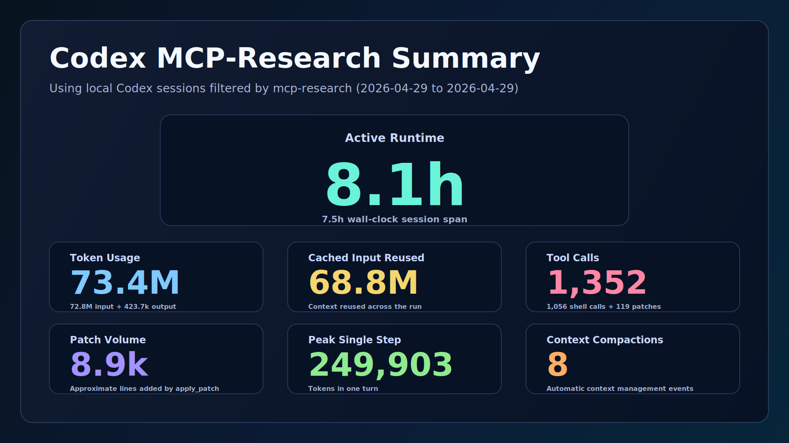

# MCP Research Codex Project Summary

Generated: `2026-04-29T13:04:37.910702Z`
Repo filter: `mcp-research`
Privacy: Aggregate metrics only. Raw prompts and transcript text are not exported.

PDF render: [mcp_research_codex_project_summary_2026-04-29.pdf](mcp_research_codex_project_summary_2026-04-29.pdf)

## Long Horizon-style Metrics

- Active runtime: `8.1h`
- Wall-clock span: `7.5h`
- Token usage: `73.4M` (`72.8M` input + `423.7k` output)
- Cached input reused: `68.8M`
- Tool calls: `1,352` (`1,056` shell + `119` patches)
- Patch volume: `8.9k` lines from `apply_patch` calls
- Peak single step: `249,903` tokens
- Context compactions: `8`

## Session Coverage

- Sessions included: `15`
- Subagent sessions: `13`
- Interactive sessions: `15`
- Automation sessions: `0`
- Sessions with token telemetry: `15`
- Date range: `2026-04-29T05:35:42.231000Z` to `2026-04-29T13:04:35.938000Z`

## Repository State

- Commits: `9`
- Tracked files: `60`
- Paper sections: `12`
- Source-note files: `7`
- Wiki pages: `35`
- Git patch volume: `10,940` additions, `599` deletions
- Wiki validation status in latest stored report: `pass`

## Top Sessions by Total Tokens

- `019dd7d4-6e6a-7f03-9719-85a1aa927515`: `54,134,464` tokens, `2026-04-29T06:01:56.607000Z` to `2026-04-29T13:04:35.938000Z`; `main` `session`
- `019dd87b-6233-7941-8ce0-fc9870e9d8ed`: `6,429,924` tokens, `2026-04-29T09:04:18.090000Z` to `2026-04-29T09:15:09.726000Z`; `worker` `Aquinas`
- `019dd87b-61a3-73b0-b421-313d86d01cd9`: `2,621,162` tokens, `2026-04-29T09:04:17.860000Z` to `2026-04-29T09:12:26.474000Z`; `worker` `Carver`
- `019dd87b-6140-7072-aacd-72e07943b268`: `1,998,011` tokens, `2026-04-29T09:04:17.744000Z` to `2026-04-29T09:09:31.577000Z`; `worker` `Boole`
- `019dd869-43c5-7ff3-b984-88011dee5e2d`: `1,873,414` tokens, `2026-04-29T08:44:30.585000Z` to `2026-04-29T08:49:51.579000Z`; `worker` `Avicenna`

## Method Notes

- Data source: local Codex `sessions` and `archived_sessions` JSONL records.
- Sessions are included when `session_meta.payload.cwd` contains the repo filter.
- Token totals use the latest `token_count.total_token_usage` snapshot per session.
- Patch volume is estimated from added `+` lines in `apply_patch` payloads.
- Active runtime is summed per session, so parallel subagents increase the aggregate runtime.
- Raw prompts, local transcript text, and absolute session-file paths are not exported.
